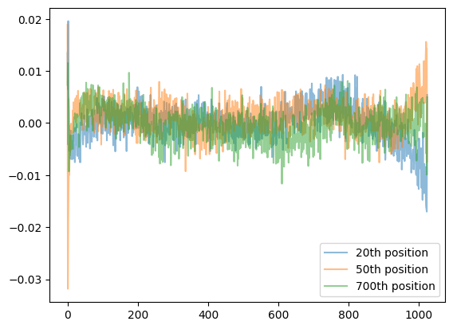
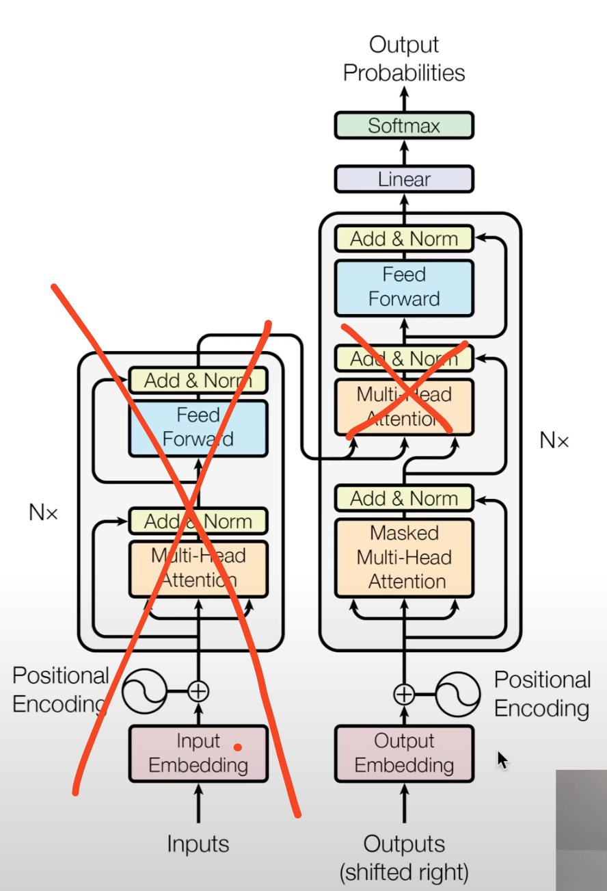
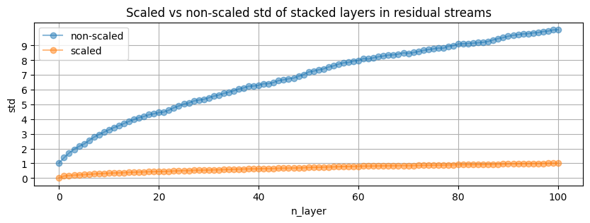
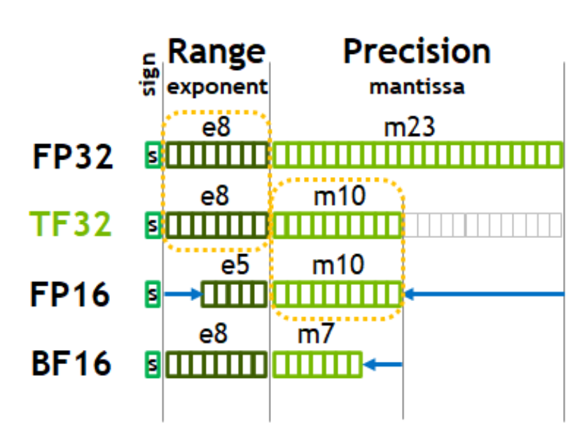
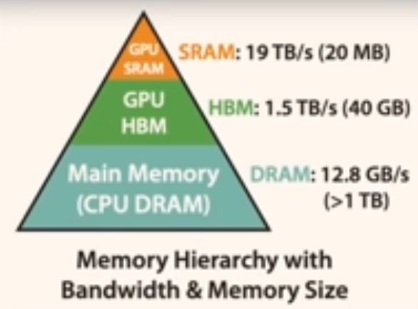
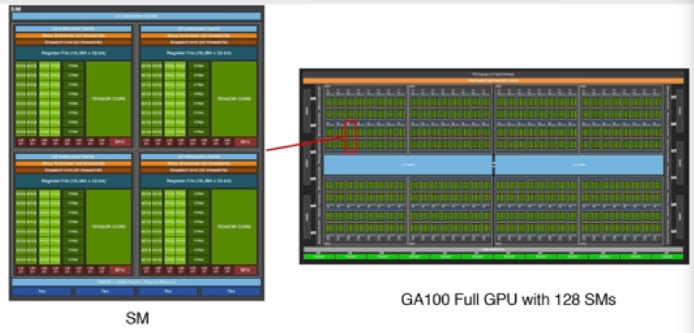
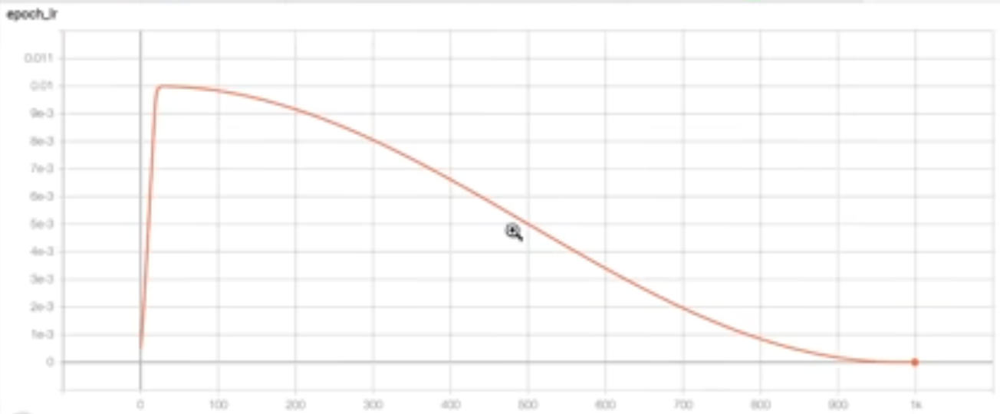
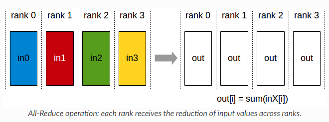
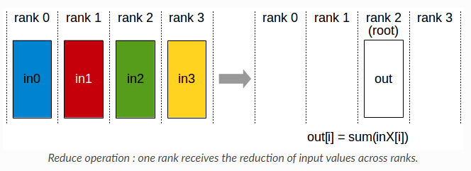

# GPT-2
95% of code and the whole idea belongs to Andrej Karpathy. I only added a lot of unhinhed comments that allowed me to understand what is going on, where and why. I also added some other stuff and plan to slowly add stuff like KV-Cache, RoPE and whatever my motivation and free time allows. 

Main files:
```
gpt2.py       -- contains the model architecture and class
train_gpt2.py -- whole train loop 
```

## Walkthrough notes:

- Noisy embedding lines in the embedding layer mean that the model could be trained some more
  

- GPT-2 is decoder only, therefore its architecture is:

  Also:
  - the positional embeddings are learned
    the way they are noisy in the original model tells that its undertrained
  - layer notexts are before, not after blocks
    this is because clean residual pathways are a desirable architecture choice
    this allows gradients to flow from the very top uninterrupted, due to addition
    just passing them down
  - layer notext was added after final self attention
  - h in module dict is the whole gray block
  - mlp is map, attention is reduce
  - linear layers are initialized as normal(0, 0.02), with bias 0, embedding also as normal(0, 0.02), by default torch does not initialize bias as 0. Normally if one follows the Javier initialization, the std should be equal to $\frac{1}{\sqrt{\text{n}\textunderscore\text{module}\textunderscore\text{features}\textunderscore\text{incoming}}}$, the GPT2 paper roughly follows that, as $\frac{1}{\sqrt(768)}=0.036$ so its not too far from $0.02$
  - layernorm also could be initialized, but we leave it as default, which is scale 1 and offset 0
  - the accumulated std of layers stacked in the residual stream is kept at 1, so that the growth of activations after a forward pass (not totally clear how to intuitively see that) is controlled
  
  Which looks a lot like the [growth of variance in random walk](https://stats.stackexchange.com/questions/159650/why-does-the-variance-of-the-random-walk-increase)
  - when using `torch.manual_seed` for different devices -- it really works and gives same results
  - Andrej uses `import code; code.interact(local=locals())` for drop-in debugs
  - int8 are used in inference, not training due to the uniformity of their spacing, i honestly have no idea what that means, probably the most no idea of all the stuff i was unsure about in this repo, whats more is floats are needed so that we match the weights and activations distributions -- what the hell does that mean, i really dont know yet (its midnight, maybe i know but not now)
  - changing dtype impacts 3 different factors: 1. FLOPS, 2. VRAM, 3. Memory bandwidth speed, for example A100 80GB for Float16 is (312 TFLOPS, 80GB, ~2000GB/s), this is great to learn more: [A100 whitepaper](https://images.nvidia.com/aem-dam/en-zz/Solutions/data-center/nvidia-ampere-architecture-whitepaper.pdf)
  - mps is very (VERY) sensitive to other workload, I was getting 2-3k tokens per sec in training, as soon as I just swiped to my left screen, it dropped to 300 toks/sec
  - Float32 vs TF32 (and others):
  
    Intuitively: exponent spans the range, while mantissa allows more finegrained placement of numbers on this range. In TF32 mantissa is crushed to 10 bits (from 23), I think MPS supports BFloat16, and not TF32 [MPS shader dtypes](https://developer.apple.com/documentation/metalperformanceshaders/mpsdatatype) is the only documentation of dtypes I could quickly find. -- coming back to this: there is a quick function in `scratch.py` to check dtypes available on the device, and it looks like MPS does not support `torch.bfloat16`, but CPU does
  - FP32, TF32, and BF16 span the same range, but gradually lower precision, FP16 spans smaller range of number, which is why it cant be used interchangebly with the other 3 -- we cant represent all the same numbers so we would have to scale gradients etc. Look [here](https://pytorch.org/tutorials/recipes/recipes/amp_recipe.html) for a good read up on automatic mixed precision use in pytorch. It basically says that if we dont change the range of dtype used, then we should use `autocast` as a context manager for a forward pass and loss calculation (and only this! without optimizer step etc.), it also says that we should not be casting manually any tensors to half (FP16) or BF16. What Im unsure here is: why using FP16 would need to use gradient scalars? Couldnt we calculate gradient with FP16 as well, so everything is in the same range from the start, and nothing needs to be scaled?
  - Only some parts of the model are impacted [autocast docs](https://pytorch.org/docs/stable/amp.html#cpu-ops-that-can-autocast-to-bfloat16), as some operations are more sensitive to precision changes and should not be automaticaly downcasted (cant be done safely for general case) ie softmax, layernorms, etc
  - `torch.compile` does kernel fusion on elementwise operations, reducing the number of trips the data takes between the GPU and HBM (probably does more things), `torch.compile` in general reduces python overhead and gpu read/writes
  
  
  Not only the CPU <-> GPU transfer is important. Also the speed and number of I/Os between SRAM and HBM need to be tracked, as they can often cause a bottleneck. Kernel fusions are especially useful for this, as they reduce the number of SRAM <-> HBM transfers.
  - if `autocast` throws device error -- make sure you pass a device string, not device object ie if you have something like `torch.device("cuda")`, you want to pass it as `with torch.autocast(device_type=device.type, ...` 
  - Flash Attention is a kernel fusion operation. Why cant `torch.compile` do it then? Cause it demands an algorithmic rewrite of the attention mechanism. Even though Flash Attention is more computationaly costly, it needs less HBM/SRAM transfers, which turn out to be the cause of a big chunk of attention runtime. Therefore, by using more compute, we reduce data transfers, and save time overall. The main premise of Flash Attention is that the big attention matrix (T, T) of interaction between keys and queries is never materialized. [FlashAttention](https://arxiv.org/abs/2205.14135) and [FlashAttention2](https://arxiv.org/abs/2307.08691), and the main mechanism behind the way that Flash Attention works is the one of [partial softmax calculation mechanism](https://arxiv.org/abs/1805.02867). Flash Attention helps even on CPU, getting us from 776 tok/s -> 1154 tok/s.
  - Powers of 2 are really powerful. We probably all know, that basically everything inside of a computer is a power of 2. We want powers of 2. They need less edge cases, and usually do not have to be specially treated. We need them so bad that we go through the code looking for number that do not have a lot of powers of 2 and fix them, and that will yield big improvemtents. One of these numbers is the vocab_size=50257, we push it slightly to 50304, and it turns out we can divide it even by 128. This moves us from 776 tok/s -> 818 tok/s (No FlashA) -> 1191 tok/s (+FlashA). This functionally doesnt change anything. WTE layer is never indexed to these additional weights, as we simply dont have these tokens in the tokenizer, and the lm_head will assign some probabilities to these embeddings, and will have to drive them to -inf (cause theyre never going to appear, so their probability has to be 0), but that is not different from real tokens that may never appear, or appear really sporadically. 
  - There is not really much to write about the learning rate and cosine decay. Basically if you see it for the first time, the idea is that learning rate is modulated, by some coefficient (the more scientific shit I read, the more I write like them -- this only means $lr \cdot coeff$). In this case the coefficient changes in 3 different ways, depending on where we are in the training: 1. It grows linearly, from some small value ie. $0.1 \cdot lr$, to $lr$, 2. Gets smaller like a cosine does from it's peak, 3. stays constant until the end of the training, ie. $0.1 * lr$ again. On the graph it looks like this:
  
  - Weight decay: the GPT3 paper states that for the training OpenAI (Im having seizure writing they're Open when this paper is literally CloseAI) used weight decay to regularize the weights. The regularization is $0.1$.
  - Gradient accumulation can be used as a way to mimick the big batch sizes of the GPT-2 without having OpenAI level of resources, just accumulate the gradient, and make the optimizer step whenever you need. The important bit here is that the torch loss usually reduces the batch loss with "mean". Im gonna botch it, Karpathy really put it nicely in the vid, but in general the accumulation would reduce all the little gradients accumulated only by the mean of batch size $B$, but our real batch size when accumulating is $B\cdot accumulation\textunderscore steps$.
  - DDP is Distributed Data Parallel. It allows you to run make some $n$ copies of the model and split the data between them, effectively cutting the training time by about $n$. The DDP comes with parallel work specific terms -- Rank, Local Rank, World Size, Node, AllReduce. 
    - Node -- a single machine, that could have an arbitrary number of GPUs
    - Rank -- an ID assigned to a process running on one of the GPUs, unique for all the GPUs in the training run (2 nodes with 2 GPUs each = 4 Ranks)
    - Local Rank -- an ID assigned to a process running on one of the GPUs on a specific node, unique only on node (2 nodes with 2 GPUs each = 2 Local Ranks each)
    - World Size -- number of all GPUs (processes) that are started in the distributed training run (2 nodes with 2 GPUs = World Size of 4)
    - AllReduce -- same as reduce, Array -> SingleNumber operation, but shares the result with all Ranks in the training run (Reduce only leaves result on one Rank), we run AllReduce after a single forward pass on all Ranks, averaging the gradient and sharing it with all Ranks, so they can all do the same optimizing step
  
  
## Other quick wisdom
- torch buffers are basically non-learnable model tensors
- torch view and reshape are very similar, 
but 1. reshape can handle non-contigous tensors (still have to check what goes wrong with non-contigous), 
and 2. view will return a tensor using the same memory area as the viewed object, reshape may clone or return same mem
- at network initialization we expect all the vocab tokens to have roughly equal probabilities, we do not want the distribution to be spikeyyyyy, therefore in this case the loss should be equal to $$L(\frac{1}{\text{vocab}\textunderscore\text{size}}) = L(\frac{1}{50257}) = -ln(\frac{1}{50257}) = 10.82$$
- genius advice: to be quite sure your implementation is correct, check if you can totally overfit on a single example
- `.data_ptr()` allows to check where in memory the tensor is stored
- lm_head and wte weights are **the same** it comes from the 2016 paper [Using the Output Embedding to Improve Language Models](https://arxiv.org/pdf/1608.05859), which argues that it significantly improves performance and the intuitive explanation is that *"for the input embedding, we would like the
network to react similarly to synonyms, while in
the output embedding, we would like the scores
of words that are interchangeable to be similar"*, makes us save ~30% of model parameters, banger
- `apply` on `nn.module` subclass is going to apply its argument to all subclass modules (i think only modules, not sure tho)
- I did not observe any speed up from using `torch.set_float32_matmul_precision("high")` on MPS (10 batches of B=16, T=256) -- checked later and MPS doesnt support even bfloat16, but when run with CPU it seems to be supported
  ```
  With lower precision:
    Mean Batch time: 1.82s
    Mean tokens/sec: 2265.09
  Without lower precision:
    Mean Batch time: 1.74s
    Mean tokens/sec: 2400.92
  ```
  A100 whitepaper it should 8x, but in Andrej's case it only 3x, in mine... yeah you can see
- `torch.cuda.max_memory_allocated` looks hella usefull for when you cant pinpoint the vram usage with nvidia-smi/nvtop, and you have this tingling feeling that you should look at max allocated memory cause it feels too much, this gives max allocated memory since the start of the program
- both `torch.compile` and `torch.autocast` are unusable for device "mps" and M series macbooks (or at least i couldnt make them run without significant effort), additionaly `autocast` works really bad with device "cpu", almost freezing the program, `compile` runs, but performance is slightly worse compared to non-compiled one (650 tok/s vs 750)
- Pretty cool that you can pass parameter groups and their specific optimization parameters, as we do with weight decay
  ```
      param_dict = {pn: p for pn, p in self.named_parameters() if p.requires_grad}
      decay_params = [pn for pn, p in param_dict.items() if p.dim() >= 2]
      nondecay_params = [pn for pn, p in param_dict.items() if p.dim() < 2]
      optim_groups = [
          {"params": decay_params, "weigth_decay": weight_decay},
          {"params": nondecay_params, "weigth_decay": 0.0},
      ]
      optimizer = torch.optim.AdamW(optim_groups, lr=lr, betas=(0.9, 0.95), eps=1e-8)
  ```
- AllReduce is the same as Reduce, but leaves the Reduce result in every rank (device, process, etc) instead of a single place. We can easily work with cross-Rank variables by for example doing custom allReduce: `torch.distributed(some_variable, op=torch.distributed.ReduceOp.SOMEOP)`.                                                                 




## My whims
- Train with rope
- Play with params on small models
- Play with other activation functions
- Learn more about layernotexts and sparsity
- Set tokens not seen in the input.txt to -inf from start
- Organize README better, add code snippets for smaller chapters
- Online softmax with CUDA?

## Questions
- Why autocast to FP16 would require gradient scaling? Can't we calculate gradients with FP16 to begin with? Therefore all the tensors would be in the same number range, and I guess there wouldn't be a need to scale anything?
- 

## My implementation fuckups

#### Low quality generations with raw hf weights cloned (bc5e9a1d)
*Cautionary tale on what neither GPT-4o, nor Claude 3.5 Sonnet could help me with. Both models failed in what ultimately boiled down to string comparison. Even though both were specifically asked to debug a potential typo.*

For whatever reason my generations looks like:

```
> Hello, I'm a language model, a language model model model model model model modeling model modeling modelling modeling modeling modeling modeling modeling modelling modeling modeling modeling modeling
> Hello, I'm a language model, system, system, system, system, system, of of of of of of of of of of of of
> Hello, I'm a language model, not,not,not,not,not,not,not,not

2323232323
> Hello, I'm a language model, a language model, a language model model model model ...

Markus ... ... ... ... ... ... ...
> Hello, I'm a language model, model model, model, model, model, model, model, model, model, model not not not not
```

Instead of:

```
> Hello, I'm a language model, not a science. I'm a language designer. I want to write, I want to think. I want
> Hello, I'm a language model, I use an English sentence structure, I like words over sentences.

"That's OK I'll look
> Hello, I'm a language model, not just another language." This isn't a "language model?" It's an idea. So far, what
> Hello, I'm a language model, not a programming model. I'm not a theoretical computer model - you read that right - because my ideas are
> Hello, I'm a language model, I teach myself.

I want to know more about how languages work and why they could be used.
```

After a lot of breakpoints and print(x), print(x.shape) it turns out my `h[x].c_attn.bias` were copied in the wrong order (or so I thought), which is weird, considering that the weights seem to be copied correctly. 

Correct bias for `h[0].c_attn.bias`:

```
tensor([ 0.4803, -0.5254, -0.4293,  ...,  0.0126, -0.0499,  0.0032],
       requires_grad=True)
```

My bias:

```
tensor([-0.0198, -0.0302,  0.0064,  ...,  0.0146, -0.0021, -0.0181],
       requires_grad=True)
```

Turns out, no attention head had biases looking like this. Correct attention biases for all heads:

```
tensor([ 0.4803, -0.5254, -0.4293,  ...,  0.0126, -0.0499,  0.0032])
tensor([ 0.0092, -0.1241, -0.2280,  ...,  0.0404,  0.0494, -0.0038])
tensor([-0.0541, -0.0644,  0.0311,  ...,  0.0015, -0.0427,  0.0059])
tensor([-0.2251, -0.0644,  0.0223,  ...,  0.0205, -0.0017, -0.0044])
tensor([-0.0302,  0.1053,  0.1579,  ..., -0.0185, -0.0097,  0.0927])
tensor([-0.0436,  0.0295,  0.0850,  ...,  0.0089, -0.0007,  0.0082])
tensor([ 0.0380,  0.1714, -0.1409,  ..., -0.0441,  0.0544,  0.0041])
tensor([ 0.3779,  0.0767,  0.0019,  ...,  0.0123, -0.0721,  0.0015])
tensor([-0.0167, -0.3909, -0.1419,  ...,  0.0212,  0.0140,  0.0999])
tensor([ 0.0571,  0.0355, -0.0991,  ...,  0.0075,  0.0219, -0.0241])
tensor([-0.0301,  0.1360, -0.3842,  ..., -0.0599,  0.1059,  0.0276])
tensor([-0.2222,  0.0549,  0.0331,  ..., -0.0289, -0.0241,  0.0063])
```

So what the hell is going on you may ask? How could you possibly put the wrong bias in out of the thin air? Naturally I went on looking at all the bias tensors in the original GPT2 state_dict -- I obviously had to mismatch the bias with the key. Imagine my surprise when I learned that this c_attn bias does not correspond to ANY of the biases in the original weights...

So I went down the weights copying hole. And who would've thought. I tried to be smarter than I am, and it backfired, as it always does. Take a close look at:

My filtering:

```
sd_keys_hf = [k for k in sd_keys_hf if "attn.bias" not in k and "attn.masked_bias" not in k]
```

Correct filtering:

```
sd_keys_hf = [k for k in sd_keys_hf if not k.endswith('.attn.masked_bias')]
sd_keys_hf = [k for k in sd_keys_hf if not k.endswith('.attn.bias')]
```

My `.c_attn.bias` was simply initiated randomly, because I filtered additional keys. 

How to fix this?

```
"attn.bias" -> ".attn.bias"
```

Or just listen to people smarter than you and don't take shortcuts as I wanted to. Also, never take LLM debugging for granted.

#### MPS is slower in slower in inference than CPU, but ~4x faster in training.. hmmm...

I will get to the bottom of that.

#### Torch compile problems on MPS

```
OpenMP support not found. Please try one of the following solutions:
(1) Set the `CXX` environment variable to a compiler other than Apple clang++/g++ that has builtin OpenMP support;
(2) install OpenMP via conda: `conda install llvm-openmp`;
(3) install libomp via brew: `brew install libomp`;
(4) manually setup OpenMP and set the `OMP_PREFIX` environment variable to point to a path with `include/omp.h` under it.
```

I did 1., which resulted in the problem disappearing, but now the compilation seems to be stuck. Program is non-responsive. 

Wait, maybe just REALLYYYY slow? Interrupted two times and different calls were printed. 

Ok nvm -- the thing that does not work on M series MBP I'm currently writing this is `autocast` (or probably is really damn slow), also `torch.compile` works when device is cpu, but makes the batch runtime higher, so dont bother doing it for now.