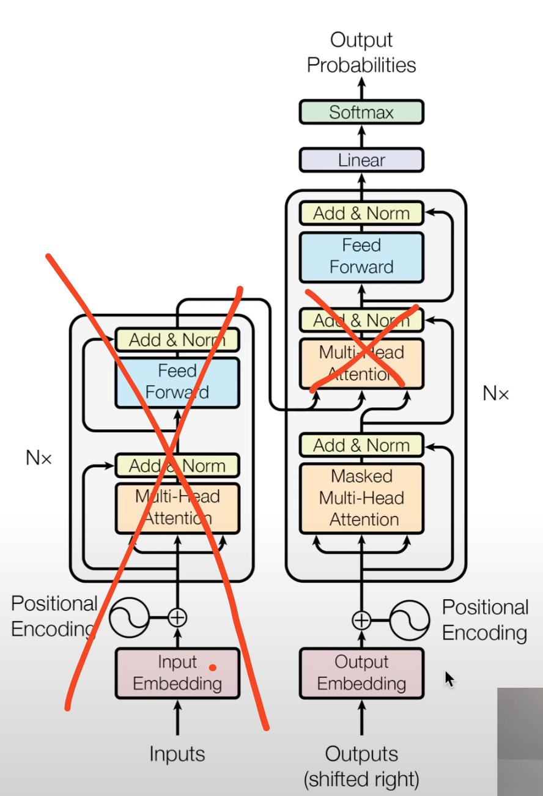

# GPT-2
Following master Karpathy with GPT-2 implementation and training

## Walkthrough notes:

- Noisy embedding lines mean that the model could be trained some more

- GPT-2 is decoder only, therefore its architecture is:

  Also:
  - the positional embeddings are learned
    the way they are noisy in the original model tells that its undertrained
  - layer norms are before, not after blocks
    this is because clean residual pathways are a desirable architecture choice
    this allows gradients to flow from the very top uninterrupted, due to addition
    just passing them down
  - layer norm was added after final self attention
  - h in module dict is the whole gray block
  - mlp is map, attention is reduce

## Other quick wisdom
- torch buffers are basically non-learnable model tensors
- torch view and reshape are very similar, 
but 1. reshape can handle non-contigous tensors (still have to check what goes wrong with non-contigous), 
and 2. view will return a tensor using the same memory area as the viewed object, reshape may clone or return same mem
- at network initialization we expect all the vocab tokens to have roughly equal probabilities, we do not want the distribution to be spikeyyyyy, therefore in this case the loss should be equal to $$L(\frac{1}{\rm{vocab_size}}) = L(\frac{1}{\rm{50257}}) = -ln(\frac{1}{\rm{50257}}) = 10.82$$

## my whims
- train with rope
- play with params on small models
- play with other activation functions
- learn more about layernorms and sparsity

## My implementation fuckups

#### Low quality generations with raw hf weights cloned (bc5e9a1d)
*Cautionary tale on what neither GPT-4o, nor Claude 3.5 Sonnet could help me with. Both models failed in what ultimately boiled down to string comparison. Even though both were specifically asked to debug a potential typo.*

For whatever reason my generations looks like:

```
> Hello, I'm a language model, a language model model model model model model modeling model modeling modelling modeling modeling modeling modeling modeling modelling modeling modeling modeling modeling
> Hello, I'm a language model, system, system, system, system, system, of of of of of of of of of of of of
> Hello, I'm a language model, not,not,not,not,not,not,not,not

2323232323
> Hello, I'm a language model, a language model, a language model model model model ...

Markus ... ... ... ... ... ... ...
> Hello, I'm a language model, model model, model, model, model, model, model, model, model, model not not not not
```

Instead of:

```
> Hello, I'm a language model, not a science. I'm a language designer. I want to write, I want to think. I want
> Hello, I'm a language model, I use an English sentence structure, I like words over sentences.

"That's OK I'll look
> Hello, I'm a language model, not just another language." This isn't a "language model?" It's an idea. So far, what
> Hello, I'm a language model, not a programming model. I'm not a theoretical computer model - you read that right - because my ideas are
> Hello, I'm a language model, I teach myself.

I want to know more about how languages work and why they could be used.
```

After a lot of breakpoints and print(x), print(x.shape) it turns out my `h[x].c_attn.bias` were copied in the wrong order (or so I thought), which is weird, considering that the weights seem to be copied correctly. 

Correct bias for `h[0].c_attn.bias`:

```
tensor([ 0.4803, -0.5254, -0.4293,  ...,  0.0126, -0.0499,  0.0032],
       requires_grad=True)
```

My bias:

```
tensor([-0.0198, -0.0302,  0.0064,  ...,  0.0146, -0.0021, -0.0181],
       requires_grad=True)
```

Turns out, no attention head had biases looking like this. Correct attention biases for all heads:

```
tensor([ 0.4803, -0.5254, -0.4293,  ...,  0.0126, -0.0499,  0.0032])
tensor([ 0.0092, -0.1241, -0.2280,  ...,  0.0404,  0.0494, -0.0038])
tensor([-0.0541, -0.0644,  0.0311,  ...,  0.0015, -0.0427,  0.0059])
tensor([-0.2251, -0.0644,  0.0223,  ...,  0.0205, -0.0017, -0.0044])
tensor([-0.0302,  0.1053,  0.1579,  ..., -0.0185, -0.0097,  0.0927])
tensor([-0.0436,  0.0295,  0.0850,  ...,  0.0089, -0.0007,  0.0082])
tensor([ 0.0380,  0.1714, -0.1409,  ..., -0.0441,  0.0544,  0.0041])
tensor([ 0.3779,  0.0767,  0.0019,  ...,  0.0123, -0.0721,  0.0015])
tensor([-0.0167, -0.3909, -0.1419,  ...,  0.0212,  0.0140,  0.0999])
tensor([ 0.0571,  0.0355, -0.0991,  ...,  0.0075,  0.0219, -0.0241])
tensor([-0.0301,  0.1360, -0.3842,  ..., -0.0599,  0.1059,  0.0276])
tensor([-0.2222,  0.0549,  0.0331,  ..., -0.0289, -0.0241,  0.0063])
```

So what the hell is going on you may ask? How could you possibly put the wrong bias in out of the thin air? Naturally I went on looking at all the bias tensors in the original GPT2 state_dict -- I obviously had to mismatch the bias with the key. Imagine my surprise when I learned that this c_attn bias does not correspond to ANY of the biases in the original weights...

So I went down the weights copying hole. And who would've thought. I tried to be smarter than I am, and it backfired, as it always does. Take a close look at:

My filtering:

```
sd_keys_hf = [k for k in sd_keys_hf if "attn.bias" not in k and "attn.masked_bias" not in k]
```

Correct filtering:

```
sd_keys_hf = [k for k in sd_keys_hf if not k.endswith('.attn.masked_bias')]
sd_keys_hf = [k for k in sd_keys_hf if not k.endswith('.attn.bias')]
```

My `.c_attn.bias` was simply initiated randomly, because I filtered additional keys. 

How to fix this?

```
"attn.bias" -> ".attn.bias"
```

Or just listen to people smarter than you and don't take shortcuts as I wanted to. Also, never take LLM debugging for granted.